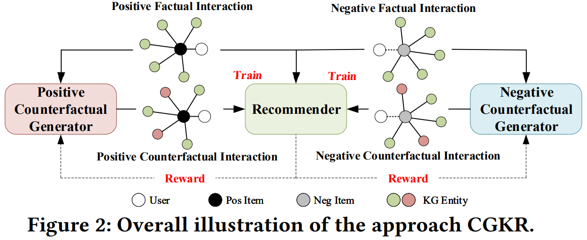

# CGKR

This is the official PyTorch implementation for the paper:
> Shanlei Mu, Yaliang Li, Wayne Xin Zhao, Jingyuan Wang, Bolin Ding and Ji-Rong Wen.
> Alleviating Spurious Correlations in Knowledge-aware Recommendations through Counterfactual Generator. SIGIR 2022.
---
Our implementation is based on [RecBole](https://github.com/RUCAIBox/RecBole) v0.1.1.

## Overview

For tackling spurious correlation issue in knowledge-aware recommendaiton, we present a novel approach to discovering
and alleviating the potential spurious correlations from a counterfactual perspective, named CGKR. Our approach consists of two 
counterfactual generators and a recommender. The counterfactual generators are designed to generate counterfactual 
interactions via reinforcement learning, while the recommender is implemented with two different graph neural networks 
to aggregate the information from KG and user-item interactions respectively. The counterfactual generators and 
recommender are integrated in a mutually collaborative way. With this approach, the recommender helps the counterfactual
generators better identify potential spurious correlations and generate high-quality counterfactual interactions,
while the counterfactual generators help the recommender weaken the influence of the potential spurious correlations
simultaneously.

<div  align="center"> 

</div>

<div  align="center"> 

</div>


## Requirements

```
python==3.8.3
pytorch==1.7.0
```

## Download Datasets and Pre-trained Model

Datasets: [Baidu Wangpan](https://pan.baidu.com/s/1EGMSaj4qTIk0E_3qOKwFOg) (Password: yn9m),
 Google Drive (Coming soon).

Pre-trained Model: Coming soon

## Quick Start

First, download the processed datasets and pre-trained models (if needed), then move the dataset to `datset/` and
move the pre-trained model to `pretrained/`.

If you don't need the pre-trained models, comment this line `pretrained_model_path: 'pretrained/*.pth'` in the file `yaml/*.yaml`.

Train and evaluate on Yelp dataset:
```
python run.py --dataset=yelp --config_files yaml/yelp.yaml
```

Train and evaluate on Music dataset:
```
python run.py --dataset=lfm-1b15 --config_files yaml/lfm-1b15.yaml
```

Train and evaluate on Movie dataset:
```
python run.py --dataset=ml-10m --config_files yaml/ml-10m.yaml
```


## Contact

If you have any questions for our paper or codes, please send an email to shanleimu@outlook.com.


### Acknowledgement

The implementation is based on the open-source recommendation library [RecBole](https://github.com/RUCAIBox/RecBole).

Please cite the following papers as the references if you use our codes or the processed datasets.

```bibtex
@inproceedings{mu2022cgkr,
  title = {Alleviating Spurious Correlations in Knowledge-aware Recommendations through Counterfactual Generator},
  author = {Shanlei Mu and Yaliang Li and Wayne Xin Zhao and Jingyuan Wang and Bolin Ding and Ji-Rong Wen},
  booktitle = {{SIGIR}},
  year = {2022}
}


@inproceedings{zhao2021recbole,
  title={Recbole: Towards a unified, comprehensive and efficient framework for recommendation algorithms},
  author={Wayne Xin Zhao and Shanlei Mu and Yupeng Hou and Zihan Lin and Yushuo Chen and Xingyu Pan and Kaiyuan Li and Yujie Lu and Hui Wang and Changxin Tian and Yingqian Min and Zhichao Feng and Xinyan Fan and Xu Chen and Pengfei Wang and Wendi Ji and Yaliang Li and Xiaoling Wang and Ji-Rong Wen},
  booktitle={{CIKM}},
  year={2021}
}
```